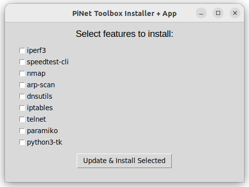
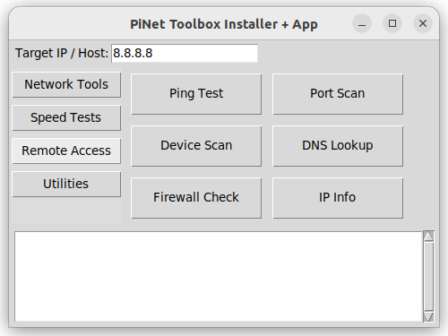

# PyNetTools 🛠️

A compact touchscreen-friendly network diagnostics and utilities suite built for Raspberry Pi and other Debian/Ubuntu systems.  
Perfect for tech enthusiasts, sysadmins, and tinkerers with a 3.5" touchscreen and a Raspberry Pi 3/4/5 — but also fully compatible with x86/x64 Linux systems!

---

## ✨ Features

✔️ Interactive GUI with categorized tools  
✔️ Auto-installer for all dependencies  
✔️ Network diagnostics: ping, port scan, arp-scan, DNS, firewall check  
✔️ Speed testing: `speedtest-cli`, `iperf3` server & client  
✔️ SSH and Telnet remote command support  
✔️ Easy-to-read output and `/boot/network_report.txt` logging  
✔️ Works on Raspberry Pi **and** standard Linux desktops/laptops

PLEASE NOTE: You NEED apt, python3, python-tk, and python-pip to run this!

---

## 🖥️ Screenshots
### Installer/Update screen


### Main Menu


---

## 🚀 Getting Started

### 1. Clone the repo (Most OSes)
```bash
git clone https://github.com/Eggstew137/PyNetTools
cd PyNetTools
mv PyNetTools/pynettools.py /home/youruser/pynettools.py
```
### 2. Running PyNetTools!
```bash
sudo python3 pynettools.py
```
Select what components you want to update/install (if you install a component the first time you run it, it will update if you select it subsequent times)
And you're done!  Have fun using PyNetTools!


